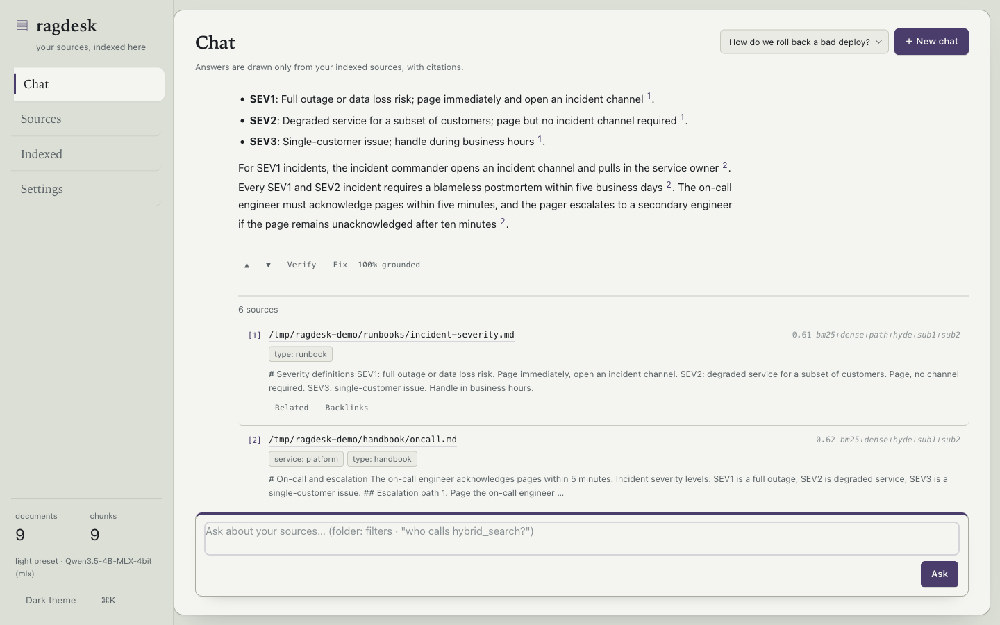
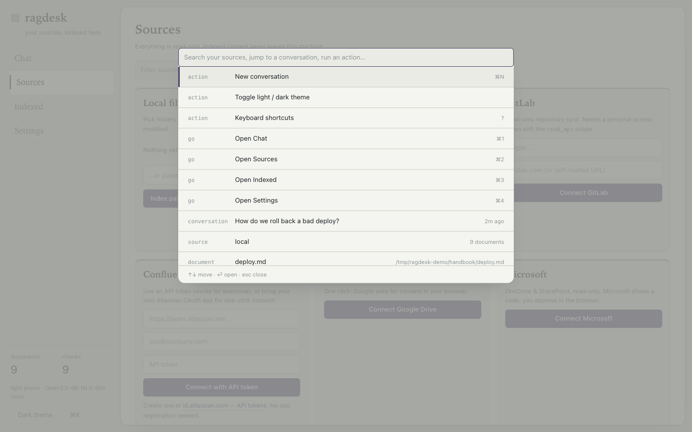
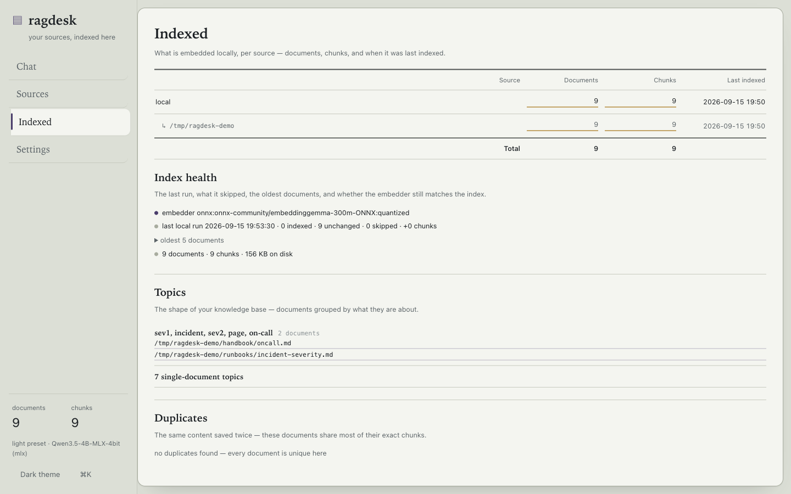
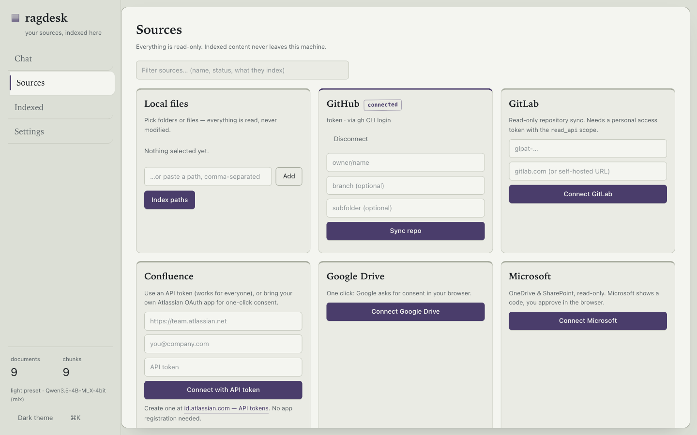
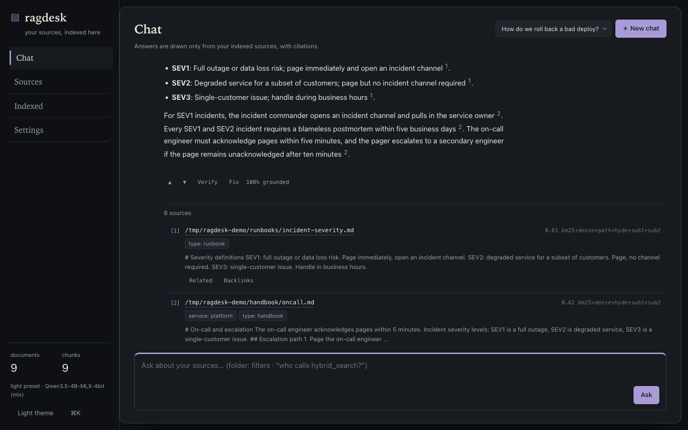
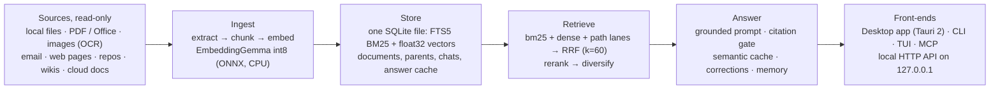

<p align="center">
  
</p>

<h1 align="center">ragdesk</h1>

<p align="center"><strong>Personal, local-first retrieval over everything you own.</strong><br>
Index your notes, repos, PDFs, spreadsheets, screenshots and email — then ask in
plain language and get answers that cite the file they came from. It all runs on
your machine, in one SQLite file, and every release publishes its retrieval
numbers.</p>

<p align="center">
  <a href="https://github.com/dtduc-git/ragdesk/actions/workflows/ci.yml"></a>
  <a href="https://github.com/dtduc-git/ragdesk/actions/workflows/eval.yml"></a>
  
  
  
  
</p>

<p align="center">
  <a href="#quickstart">Quickstart</a> ·
  <a href="#screenshots">Screenshots</a> ·
  <a href="#architecture">Architecture</a> ·
  <a href="#eval">Eval</a> ·
  <a href="#what-works-today-honest-list">What works</a> ·
  <a href="#non-goals">Non-goals</a> ·
  <a href="docs/sources.md">Source guides</a>
</p>

---

ragdesk is an open-source, vendor-neutral retrieval desk for people who keep
their knowledge in files: engineers with runbooks and repositories, analysts
with spreadsheets and PDFs, anyone with a documents folder that has outgrown
itself. It bundles hybrid retrieval (SQLite FTS5 BM25 + EmbeddingGemma
embeddings, fused with Reciprocal Rank Fusion), a grounded answer pipeline over
a local or self-hosted model, an evaluation harness that puts numbers on
quality, and a desktop app with a command palette — no server, no account, no
telemetry, no data leaving the machine.

**Quality is a number here, not a vibe.** ragdesk ships its retrieval eval from
day one and gates `recall@5 >= 0.8` in CI, so regressions fail the build. The
table is in [Eval](#eval); the tuning levers that lost are documented next to
the ones that won.

> **Status: pre-alpha (0.1.0).** Retrieval core, eval harness, email/web/repo
> connectors, CLI + TUI + MCP server and the Tauri desktop app are in. Not on
> PyPI yet — run from source.

## Why another personal RAG?

Most "chat with your documents" tools ask you to trust them. This one shows its
work at three levels:

- **Answers cite files, with line numbers.** Every factual sentence carries a
  `[n]` marker that maps to a source card; click it and the file opens. The
  built-in Verify button scores each sentence against the cited text, so an
  answer that drifts from its sources is visible, not hidden.
- **Retrieval is measured.** `ragdesk eval` runs a golden set of queries and
  prints recall@5 / nDCG@10 / MRR (overall and per category); the repo publishes
  those numbers and CI enforces them. Ideas that measured badly — symbol-aware
  chunking, lane weights, a graph lane — were dropped and written down.
- **Everything is inspectable and local.** One SQLite file holds the documents,
  the FTS index, the vectors, the chats and the answer cache. The core is
  stdlib-only Python; the HTTP API binds loopback; sources stay read-only.

## Screenshots

| Chat with citations | Command palette (⌘K) |
|---|---|
| [](docs/screenshots/chat-answer.png) | [](docs/screenshots/palette-demo.png) |
| **Indexed** — ledger, health, topics, duplicates | **Sources** — one card per connector |
| [](docs/screenshots/indexed-demo.png) | [](docs/screenshots/sources-demo.png) |

Dark theme is a first-class citizen: [](docs/screenshots/chat-dark-demo.png)

## Architecture



**What happens when you ask.** The question (with any `folder:` / `key:value`
filters) is checked against the exact and semantic answer caches first; a miss
runs hybrid retrieval over three lanes (BM25, dense cosine, path tokens), fuses
them with RRF (k=60), optionally reranks, and caps how many chunks one document
may contribute. The top chunks — children embedded, their ~4k-char parent
sections sent as context — go into a grounded prompt together with your
corrections, a few relevant memories and the last conversation turns. The model
streams the answer, inline `[n]` citations included, and the exchange is
recorded in SQLite. Nothing above leaves the machine: the model runs through
Ollama, MLX in-process, or an OpenAI-compatible endpoint you point at.

**Where things live.**

| Path | What |
|---|---|
| `~/.ragdesk/index.db` | the entire index: documents, chunks, FTS5, vectors, chats, answer + embedding caches, corrections |
| `~/.ragdesk/backups/` | index snapshots (Settings → Index backup; restore keeps a safety copy) |
| `~/.ragdesk/serve.log` | the desktop app's server log |
| `~/.config/ragdesk/credentials.json` | connection credentials, mode `0600` |
| `~/.config/ragdesk/settings.json` | app settings, mode `0600` |

## Quickstart

```bash
# 1. install ([onnx] for CPU embeddings; [mlx] on Apple Silicon to run the
#    answer model in-process; [vision] for image OCR; [tui] for the full-screen
#    terminal app — all optional)
uv tool install 'ragdesk[onnx,mlx,vision,tui] @ git+https://github.com/dtduc-git/ragdesk'

# 2. index your stuff (incremental, read-only)
ragdesk index ~/notes ~/repos/myrepo

# 3. ask — the backend ladder never re-downloads what you already have:
#    a running Ollama with qwen3.5:4b (or another model via RAGDESK_LLM) wins;
#    otherwise MLX runs mlx-community/Qwen3.5-4B-MLX-4bit in-process.
ragdesk ask "how does the deploy rollback work?"
ragdesk ask "who calls hybrid_search?"           # call graph: defs + call sites (no LLM)
ragdesk ask "..." --llm ollama:qwen3.5:9b        # force a specific backend
ragdesk ask "..." --llm mlx:some/hf-repo         # or a specific MLX repo

# no Ollama and no MLX? Indexing and search still work — only chat needs a model:
ragdesk --embedder onnx index ~/notes
# EmbeddingGemma runs on CPU via ONNX (downloads ~0.3GB once)

# 4. grounding gate (calibrate the cosine threshold per embedder)
ragdesk ask "..." --min-cosine 0.35

# retrieval only
ragdesk search "oauth pkce desktop"

# save one web page (bookmark) or crawl a whole docs site
ragdesk save https://example.com/article
ragdesk web https://docs.example.com/ --max-pages 50

# email (read-only)
ragdesk email --mbox ~/Downloads/takeout.mbox    # an exported archive
ragdesk email --imap imap.gmail.com --user me@gmail.com --folder INBOX --limit 200

# shell completions + man page
ragdesk completions zsh > ~/.zsh/completions/_ragdesk
ragdesk man > ~/.local/share/man/man1/ragdesk.1

# reranking (optional)
ragdesk --rerank lexical search "..."    # dependency-free baseline
ragdesk --rerank fastembed search "..."  # ONNX cross-encoder (model downloads on first use)

# numbers
ragdesk eval --golden fixtures/golden.jsonl
ragdesk stats
```

## Terminal chat (same index as the app)

```bash
ragdesk chat                    # REPL: streaming answers + citations
ragdesk chat --chat-id 12       # resume a conversation (shared with the GUI)
echo "what is RRF fusion?" | ragdesk chat   # script-friendly one-shot
ragdesk chat --server http://127.0.0.1:8765  # attach to the running app
ragdesk tui                     # full-screen (needs the 'tui' extra)
```

`/new`, `/history`, `/sources` and the `folder:` / `key:value` filters work in
the REPL; answers stream, citations print as `path:line`. Attach mode talks to
a running server over its local API, so a second process costs no extra RAM
and both front-ends share one index and one set of loaded models.

## Use ragdesk from Claude Code, Claude Desktop or Codex (MCP)

`ragdesk mcp` speaks MCP over stdio, read-only, and reads the same index the
desktop app uses — the app does not need to be running. The Settings card
copies the exact snippet for your client.

```bash
# Claude Code
claude mcp add ragdesk -- ragdesk mcp

# Codex (~/.codex/config.toml)
[mcp_servers.ragdesk]
command = "ragdesk"
args = ["mcp"]

# Claude Desktop (claude_desktop_config.json)
{ "mcpServers": { "ragdesk": { "command": "ragdesk", "args": ["mcp"] } } }
```

Tools exposed: `ragdesk_search` (hybrid retrieval with paths and scores),
`ragdesk_document` (full text of one indexed file), `ragdesk_sources`
(document/chunk counts per source), `ragdesk_symbol` (where a code symbol is
defined and who calls it), `ragdesk_topics` (the corpus as labelled clusters)
and `ragdesk_save` (fetch one page into the index — the only tool that writes,
and it never touches your sources). Pass the same `--embedder` you indexed with
— the index refuses mismatched embeddings.

## Desktop app (Tauri 2)

```bash
# one-time: make the CLI visible to the packaged app
uv tool install '.[onnx,mlx,vision,tui]'

cd desktop
npm install
npm run tauri dev     # dev window; spawns the local server automatically
npm run tauri build   # .app + .dmg on macOS (sign with APPLE_SIGNING_IDENTITY
                      # so the folder-access grant survives rebuilds)
```

The shell spawns `ragdesk serve` (loopback only) and renders the catalog-drawer
UI: a ledger-style transcript with entry numbers and citations, ⌘K command
palette (conversations, tabs, live document search), source connectors, the
Indexed ledger with health/topics/duplicates, and Settings for the answer
engine, auto re-index, never-index patterns and one-click backups.

Per-source connection guides — API tokens, browser consent, bring-your-own
OAuth apps and their caveats — live in **[docs/sources.md](docs/sources.md)**.

- **Local sources** use a native folder/file picker (multi-select), so you
  don't paste paths.
- **Cloud sources have a one-time Connect flow**: GitHub (device code — a
  client ID ships with the app, so no CLI is needed; `gh` login and tokens
  also work), Confluence (API token — no app registration — or your own
  Atlassian OAuth app for one-click consent), Google Drive (BYO OAuth client,
  browser consent), Microsoft OneDrive/SharePoint (device flow), Notion
  (integration token), email (IMAP app password). Credentials are stored `0600`
  under `~/.config/ragdesk/` and can be disconnected from the same card.
  Atlassian client secrets are never shipped in the repository (see
  `SECURITY.md`).

The same UI also runs in a browser for development:
`uv run ragdesk serve --ui desktop/dist`.

## What works today (honest list)

| Works | Not yet |
|---|---|
| Desktop app (Tauri 2): chat with history + streaming status + stop, sources, indexed stats (per source and per chosen path), settings, dark theme — packaged as a self-contained DMG (bundled runtime, no CLI install) | Notarization (Apple Developer ID) so a *downloaded* DMG opens without the Gatekeeper bypass |
| Command palette (⌘K): jump to a conversation, switch tabs, search your sources and open a file — plus ⌘1-4 tabs, ? for the shortcut sheet | |
| The catalog-drawer look: ruled ledger transcript with entry numbers, violet library ink for actions, amber for live/cited things, light + dark | |
| Watch for changes: new and edited files in your folders are indexed automatically (Settings, default every minute; Off / 30s / 1m / 5m / 15m) | Connector auto-sync is hourly only (no per-connector interval yet) |
| Connector auto-sync: tick "Keep in sync" on any connector's sync form and it re-runs with the auto re-index timer (GitHub, GitLab, Confluence, Drive, OneDrive, Notion, IMAP, web crawl, S3) | |
| S3: paste an access key in the app once (or just point at a public bucket — no key, no extra tool), then sync a bucket prefix; AWS keys come from IAM, and **S3-compatible services** (Cloudflare R2, Backblaze B2, MinIO, Wasabi) work via a custom endpoint; PDF/Office/image/OCR handled like local files | Writing to S3 (read-only, by design) |
| Auto re-index of the chosen local paths every N hours (Settings, default 1h, Off switch) — the safety net behind the watcher | |
| Idle unload: models leave RAM after a quiet stretch (Settings, default 15 min) | |
| Quiet indexing (Settings, **on by default** — 4 threads): caps the ONNX embedding threads — measured on this repo, 651 chunks index in 97s at ~580% CPU, or 136s at ~390% with 4 threads; `--embed-threads N` goes lower (2 threads: 256s at ~200%) | |
| Metadata: a `--- key: value ---` front-matter header is parsed, stored per document and filterable — no YAML dependency; `authority:`/`status:` tags give a small rank nudge (canonical up, draft down) | |
| Indexing: local files (native picker), **PDF / DOCX / PPTX / XLSX text extraction** (sheets keep row refs; legacy `.xls` and scanned PDFs need converting), **image OCR** (screenshots, scans, photos with text — Apple Vision, on-device, no model download), GitHub repos (device code / gh / token), GitLab repos (token), Confluence spaces (connect + CQL), Google Drive (connect + doc export), Microsoft OneDrive/SharePoint (device flow), Notion (shared pages), website crawl (same-host, HTML), email (mbox / IMAP) | Legacy `.xls`, audio; OCR for scanned PDFs; VLM captions for text-free images |
| Hybrid retrieval: FTS5 BM25 + EmbeddingGemma int8 (ONNX) + RRF | Windows / Linux builds |
| Reranking: `lexical` baseline, `fastembed` (English-first), `onnx` multilingual gte (70+ languages) — batched, idle-unloaded, pool swept on the golden (docs above) | Eval badge automation per release |
| Grounded cited answers with a backend ladder: reuses Ollama when the model is there, else MLX in-process; one-click model download in Settings (live progress) | |
| Chat history: conversations in SQLite, multi-turn context, a history popover (open/delete), resume or start fresh | |
| Live progress: phased status while answering (searching → thinking, elapsed seconds) with a Stop button; sync/index activity in the rail | |
| Answer cache: an identical question on an unchanged corpus replays instantly | |
| Chunk-level embedding cache: re-indexing embeds only what changed (a duplicated file costs zero model calls; measured 96.8s → 0.2s on a 48-doc re-index) | |
| Memory: durable notes you add (or extract from a chat) ride along with every answer | |
| Corrections: fix an answer in place (Fix) and matching questions reuse your version — corrections invalidate the answer cache | |
| Semantic answer cache: a paraphrase of an answered question replays instantly (cosine ≥ 0.88, calibrated) | |
| Answer engines: Ollama, local MLX, or any OpenAI-compatible endpoint (LM Studio, llama.cpp, vLLM, OpenAI) — switchable in Settings, no terminal | |
| First-run wizard: folders → answer engine → RAM-sized preset → index, all in the UI (re-runnable from Settings) | |
| Diagrams on request: "vẽ sơ đồ …" returns a themed Mermaid figure inline, with SVG download | Charts beyond Mermaid's set |
| HyDE lane (Settings, off by default): drafts an answer with the local model, then searches with it too | |
| Scoping: `folder:` / `source:` and any front-matter key (`type:runbook service:payments`) as query filters; metadata shows as chips on citations | |
| Parent-child context: children are embedded, parents (~4k chars) go to the LLM | |
| Call graph on demand: ask "who calls hybrid_search?" and get definitions + call sites with file:line, answered from the code itself (regex scan, never a ranking lane) | Full AST/cross-language precision |
| Topic map: the Indexed tab groups documents into labelled clusters (greedy leader clustering over the stored vectors, labels = distinctive terms) | 2D visual map (needs a projection dependency) |
| Bookmarks: save one page from the Sources tab (or `ragdesk save <url>`), then Open or Refresh it later | |
| Email: read-only IMAP sync (last N messages, `BODY.PEEK` — nothing is marked read) and mbox files; one document per message, searchable by subject, sender or body, and **attachments are indexed too** (PDF/Office/images through the same extractors, OCR included; names stay listed in the message) | Mail writing/deleting; a 200-file dump attached to one message (capped at 10) |
| Duplicates: the Indexed tab lists documents that share most of their exact chunks (the same file saved twice), with open-file links | Automatic cleanup — sources stay read-only |
| Index health: the last run's skips (with reasons), oldest documents, embedder-match check and DB size | |
| Never index: glob patterns (`*secret*`, `*.pem`) are never read, and saving a pattern removes already-indexed matches | |
| Index backup: one-click snapshot (SQLite backup API, safe while in use) + restore with a safety copy; keeps the last 5 | |
| Completions + man page: `ragdesk completions bash\|zsh\|fish` and `ragdesk man`, generated from the CLI itself | |
| Scope a question to a folder: "Only this folder" on any citation keeps the next questions inside it (quoted filters, so paths with spaces work) | |
| Portable bundle: export the whole index as a zip with a manifest, import it on another machine (embedder mismatch refused, safety snapshot kept) | |
| Topic map picture: `scripts/topic_map.py` projects the corpus to 2D (PCA) and writes a self-contained HTML — clusters coloured, hover for paths | |
| Eval: per-category metrics + category gates, `--answers` faithfulness (overlap proxy), `--judge` (asks the local model to grade each answer sentence by sentence) and `--rewrite` follow-up scoring | |
| MCP server for Claude Code / Cursor (`ragdesk mcp`) | |
| RAM presets (`light` / `balanced` / `quality`) — switchable in Settings, applied live; per-flag overrides still work | |
| Eval harness + CI gates on the fixtures and repo golden sets | |

## Eval

Every number below is reproducible from the repo. `fixtures/` is a tiny
7-query smoke corpus; `fixtures/golden_repo.jsonl` is a 12-query golden set over
this repository's own docs and source.

| corpus / preset | recall@5 | nDCG@10 | MRR@10 |
|---|---|---|---|
| fixtures (7 queries) / hash-4096 — CI gate | 1.000 | 1.000 | 1.000 |
| corpus (24 queries: VN notes, PDFs, two codebases) | 1.000 | 0.964 | 0.951 |
| repo (12 queries, `folder:`-scoped) / EmbeddingGemma int8, text chunking | **0.917** | **0.874** | **0.833** |
| repo (12 queries) / + smart retrieval (rewrite + HyDE + sub-queries, one call) | 0.917 | 0.832 | 0.778 |
<!-- eval-ci:start -->
| repo docs+source subset (the CI run) / EmbeddingGemma int8 | 1.000 | 0.866 | 0.819 |
<!-- eval-ci:end -->
| follow-ups (5 queries, `fixtures/golden_multiturn.jsonl`) raw | 1.000 | 0.926 | 0.900 |
| follow-ups (5 queries) / `--rewrite` (Qwen3.5-4B MLX) | 1.000 | **1.000** | **1.000** |

**Which embedder, and why it is the one it is:** [docs/embedder-comparison.md](docs/embedder-comparison.md)
measures four multilingual candidates on the repo golden set — Gemma keeps the
default because it leads nDCG@10 (the column that matters without a reranker);
`multilingual-e5-small` is the documented speed-and-size option (2.4x smaller,
2.6x faster to index, recall within noise of Gemma).

The follow-up set is deliberately vague ("how long do they last?") — the raw
question finds the right *documents* but not at the top; the rewrite moves them
to rank 1 on all five. The same harness scores it with
`eval --golden fixtures/golden_multiturn.jsonl --rewrite`, which prints the raw
baseline next to the rewritten run.

Per-category breakdown (the `[eval]` row is the honest weak spot):

```
[answers] n=1 recall@5=1.000   [code] n=3 recall@5=1.000
[eval]    n=2 recall@5=0.500   [general] n=3 recall@5=1.000
```

Measured 2026-09-15 on the repo tree (824-document corpus including a synced
repo, hence the `folder:` scoping in the golden set).

Tuning measured with `scripts/bench.py` (fresh index per chunking config, the
same 12 scoped queries):

| lever | recall@5 | nDCG@10 | MRR@10 | verdict |
|---|---|---|---|---|
| chunk 600 chars (4158 chunks) | 0.833 | **0.792** | **0.778** | ranking up, recall down |
| chunk 1000 chars (2288) — default | 0.917 | 0.746 | 0.688 | kept |
| chunk 1500 chars (1464) | 0.917 | 0.724 | 0.660 | no gain |
| rerank `fastembed` bge-reranker-base (EN) | 0.750 | 0.708 | 0.694 | hurts a VN+code corpus |
| rerank `onnx` gte-multilingual | **0.917** | 0.782 | 0.739 | **kept for the quality preset** |
| rerank `lexical` (baseline) | 0.750 | 0.538 | 0.465 | test baseline only |
| lane weights (path 0.6 / bm25 0.9 / dense 1.2) | 0.833 | — | — | no effect; equal weights stay |

- **Symbol-aware code chunking was tried three ways and rejected**, each
  measured on fresh indexes of the same corpus (plain baseline: recall 1.000 /
  nDCG 0.819 / MRR 0.757): per-symbol segmentation (0.743 / 0.656 — fragments
  the file and raises BM25 term density), symbol headers inside chunks
  (0.788 / 0.715 — test files mention symbols in their names and out-rank the
  implementation), and a symbol lane over definition sites (0.523 / 0.419 —
  loose LIKE matching dilutes RRF). The path lane already answers "where is X
  defined"; symbol intelligence belongs in a call-graph index. Chunks still
  carry `line_start`, so citations show `file:line`.
- **Smart retrieval is a toggle, off by default.** One local-model call that
  rewrites a follow-up, drafts a hypothetical answer and proposes sub-queries.
  It helped on a noisier corpus (+0.031 nDCG) and cost a little on the current
  one (−0.042), which is why the reader decides.
- The 24-query `fixtures/golden_corpus.jsonl` set is generated by
  `scripts/make_golden.py` from corpus chunks (questions a reader could ask
  about a passage, file names filtered out). It is a **regression set** — every
  document must stay findable — not a challenge set; the hand-written
  12-query repo golden is the harder one.
- The dependency-free `lexical` reranker **lowers** nDCG/MRR here — it is a
  test baseline, not a quality feature.
- The badge above and the `[CI run]` row are refreshed by the **Eval** workflow
  (monthly, on a release tag, or by hand): it scores the golden set, rewrites
  `docs/eval.json` and this row, and commits the change only when a number
  moved — so the published figures cannot drift from the code.
- CI gates `recall@5 >= 0.8` on both harnesses (the fixtures set with the
  offline hash embedder, the repo golden with the real EmbeddingGemma model),
  so retrieval regressions fail the build.

Reproduce (first run downloads the ~0.3 GB int8 model):

```bash
# the repo golden scopes its queries with `folder:dtduc-git/ragdesk`, so index
# through a path that carries it — CI does exactly this with a symlink, over the
# docs+source subset the golden is about (the full tree works too, it is ~6x
# slower to embed)
mkdir -p /tmp/repro/dtduc-git && ln -s "$PWD" /tmp/repro/dtduc-git/ragdesk
base=/tmp/repro/dtduc-git/ragdesk
uv run ragdesk --embedder onnx --db /tmp/eval.db index \
  "$base/README.md" "$base/AGENTS.md" "$base/SECURITY.md" \
  "$base/.github" "$base/src" "$base/fixtures"
uv run ragdesk --embedder onnx --db /tmp/eval.db eval --golden fixtures/golden_repo.jsonl
uv run ragdesk --embedder onnx --db /tmp/eval.db --rerank lexical eval --golden fixtures/golden_repo.jsonl

# follow-up rewrite (needs a local model: Ollama with the preset model, or MLX)
uv run ragdesk --embedder onnx --db /tmp/eval-mt.db index fixtures
uv run ragdesk --embedder onnx --db /tmp/eval-mt.db eval --golden fixtures/golden_multiturn.jsonl --rewrite
```

## Roadmap

1. Release v0.1.0: PyPI (trusted publishing) + desktop DMG on GitHub Releases
2. Eval badge automation per release
3. More sources, following the Bedrock Knowledge Base connector set as a reference:
   S3 (bucket/prefix)
4. Windows / Linux builds
5. MCP-server expansion path for connectors

## Non-goals

- No server, no multi-user, no account.
- No telemetry — nothing leaves your machine unless you point it at a service.
- Sources are read-only; ragdesk never writes to what it indexes.
- No graph database, no agent loop in v0.1.

## Development

```bash
uv sync --all-groups
uv run pytest
uv run ruff check .
uv run --extra tui pytest     # includes the full-screen TUI tests
```

## Security & privacy

Local-first by default: the index is one SQLite file under `.ragdesk/`.
Network calls happen only to your local Ollama server; adding cloud providers
is opt-in and bring-your-own-key. Connection credentials live in
`~/.config/ragdesk/credentials.json` (mode `0600`). See [SECURITY.md](SECURITY.md).

## License

Apache-2.0.
